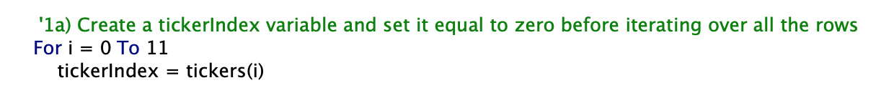
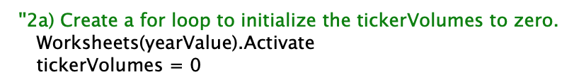
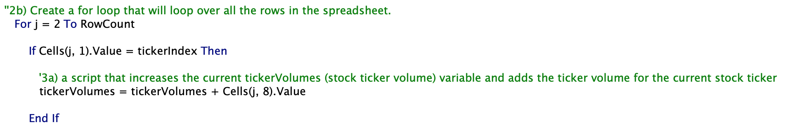
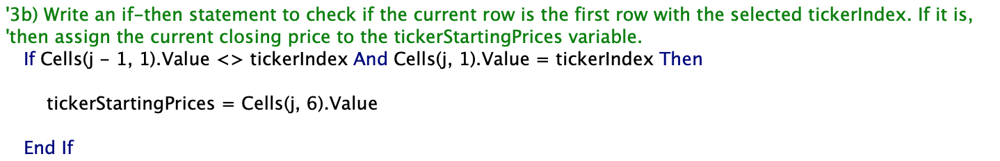
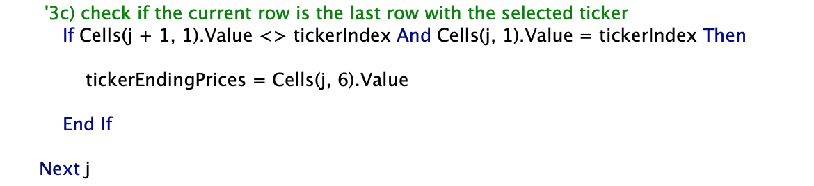
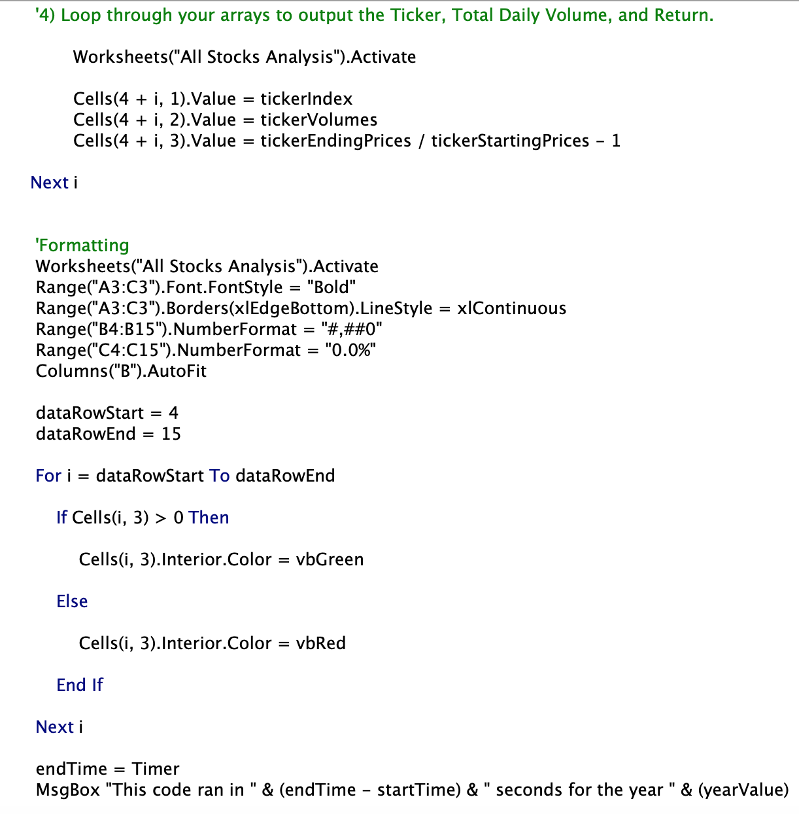
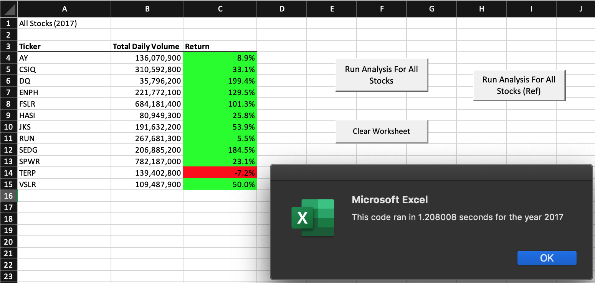
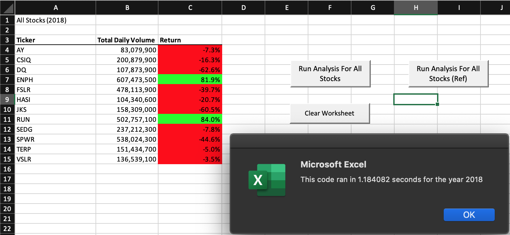

# stock-analysis

# Overview

# Background
This challenge is meant to illustrate an analyses of the entire stock market over the past couple of years. The way this is performed is by editing (refactoring) the code already established for the client (Steve) to loop through all the data one time in order to collect the same information that was performed for the clients previous task (analysing one dataset). Once this is done, we will discuss whether the refactored code was successful in making the VBA script run faster. This discussion, as well as the findings, will be presented below. The key component of Refactoring is not the addition of new functions, instead it is about making the code more efficient (via, by taking less steps, less code, less memory and enhancing the logic of the code). 

# Purpose
The purpose of the challenge is to edit, or refactor, the originial code to loop through all the data one time in order to collect the same information that was illustrated in the original code. Therfore the purpose of this challenge is to highligh the abilities, and potential benefits of using refactored code.

# Results
Here we show examples of code and compare the stock performance between 2017 and 2018 as well as the execution times of the original script and the refactored script.

1. The tickerIndex is set equal to zero before looping over the rows. 

2. Arrays are created for tickers, tickerVolumes, tickerStartingPrices, and tickerEndingPrices

3. The tickerIndex is used to access the stock ticker index for the tickers, tickerVolumes, tickerStartingPrices, and tickerEndingPrices arrays

4. The script loops through stock data, reading and storing all of the following values from each row: tickers, tickerVolumes, tickerStartingPrices, and tickerEndingPrices

5. Code for formatting the cells in the spreadsheet is working

*Please see above*

6. There are comments to explain the purpose of the code

*Please see above*

7. The outputs for the 2017 and 2018 stock analyses in the VBA_Challenge.xlsm workbook match the outputs from the AllStockAnalysis in the module

8. The pop-up messages showing the elapsed run time for the script are saved as VBA_Challenge_2017.png and VBA_Challenge_2018.png

*Please see above*

# Summary

There are certain advantages and disadvantages of using refactored code. In addition, a comparison can be drawn from the original code to the refactored code. The following illustrate those findings.

- Advantages

Refactored code creates a certain logic within the code. This code can therefore illustrate erros when produced. For example, if foreign loops, if statements do not 'flow' (act in a coherent matter with the rest of the code, then the user can identify and simplify the foreign code.
In addition, this logic in the code also creates a certain sense of 

- Disadvantages

Code that is long and complex tend to suffer more errors when refactoring takes place. This can sometimes change the outcome of the code and also the logic of the oriignal intent. Therefore one major disadvantage is the steering away from the oringial intent and change in logic.
When Refactoring takes place, it could allow complex code becoming more seamless and integrated. On face value, this may be appropriate and even warranted, however, upon closer analysis certain types of code would actually be better suited to independent blocks of code (due to the complex nature) rather than having it seamlessly integrated. This is important because when errors occur, it would be wise to highlight certain sections of the code (for a specific purpose) rather than doing a, potnetially, laborious act of reinventing the code and potentially a new logic to the code.

- Comparison to the original code

When comparing the refactored code to the original code, the refactored code is easier to maintain, cleaner to read and easy to follow the logic. I mentioned earlier that refactored code could pose a potential problem by oversimplifying complex and necessary code, and while that still holds true, in this example, it is no longer the case. The refactored code is much easier and simpler to follow and effiecent to execute. 

